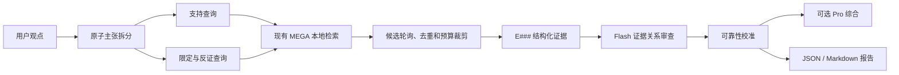

# 观点核验：用 MEGA 原文检查研究判断

## 定位

观点核验用于回答三类问题：一个判断在当前 MEGA 语料中得到什么支持；哪些部分需要缩小或加条件；还应检索哪些反例、限定和时期差异。它不是“让模型凭印象评论观点”，而是先检索，再把有限证据交给模型分类。

系统不会把“没有检索到”写成“马克思从未说过”，也不会把 APPARAT、编者导言或未分类 Textband 自动当成马克思、恩格斯原文。

## 流水线



实现复用 `research_export.retrieve_research_evidence()`，因此术语簇、纯德语 lexical fallback、多路召回、目标卷注入、规则重排、snippet 和来源层级只有一套实现。

## 结论标签

| 标签 | 含义 |
|---|---|
| `strong_support` | 已验证作者正文对该原子主张有直接、明确支持 |
| `partial_support` | 只支持主张的一部分，或证据强度不足以支持完整表述 |
| `qualified` | 主张方向有依据，但必须增加条件、时期、文本或概念限定 |
| `unsupported` | 当前候选中没有支持，但不能据此证明全库不存在 |
| `contradicted` | 已验证作者正文提供明确反向证据 |
| `insufficient` | 证据或语义审查不足，不能负责地判定 |

校准规则在模型输出之后执行：

- 编者材料声称 `supports` 或 `contradicts` 时，自动改为 `context`；
- 未分类 Textband 的 `direct` 自动改为 `unverified`；
- 没有已验证作者正文时，不允许 `strong_support`；
- 没有已验证作者反证时，不允许 `contradicted`；
- 本地零 API 模式只返回候选，结论固定保持 `insufficient`。

## 三档预算

| 预算 | 原子主张 | 每项检索面 | 总证据上限 | 默认模型用途 |
|---|---:|---:|---:|---|
| `brief` | 1 | 1 | 6 | Flash 拆分 + Flash 审查；不调用 Pro |
| `standard` | 3 | 2 | 14 | 支持、限定/反证；Pro 可选 |
| `deep` | 5 | 3 | 24 | 再加入背景检索；Pro 可选 |

先用 `brief`。只有主张包含多个时期、著作或概念关系时才升到 `standard`；`deep` 适合正式章节前的审查，而不是日常问答。

## 使用方法

工作台：双击 `启动MEGA研究工作台.bat`，在“观点核验”区域输入判断。Flash 默认启用，Pro 默认关闭。状态栏显示本次 API token、耗时和缓存命中。

隐私提示：本地模式不发送语料。启用 Flash/Pro 时，用户观点和预算内筛选出的德语 snippet 会发送到配置的外部 API；不适合外传的材料请使用 `--local-only`。

JSON CLI：

```powershell
cd D:\mega_rag

# 0 API token：只找候选，不做语义判决
python mega_agent.py verify "马克思把利润率下降理解为资本主义生产的内在趋势" --local-only

# 低成本核验：Flash 拆分并审查，默认 brief
python mega_agent.py verify "马克思在成熟经济学中放弃了异化概念" --save

# 多主张深度核验，并让 Pro 只基于证据综合
python mega_agent.py verify "你的观点" --budget standard --pro --detail snippet --save
```

单独运行并导出 Markdown / JSON：

```powershell
python claim_audit.py "你的观点" --budget brief
```

输出保存在 `research_exports/claim_audits/`，其中包含：索引版本、原子主张、检索面、每条证据的来源与可靠性、逐证据关系、校准后结论、修改建议、API token 和运行时间。

## 防回退测试

```powershell
python test_claim_audit.py
python test_agent_service.py
python eval_claim_audit.py --cases claim_eval.yaml --top-k 10
```

前两项不访问 API。`eval_claim_audit.py` 也只检查本地候选召回，不判断观点真伪；`FAIL_ALG` 返回非零退出码。

## 研究边界

- `strong_support` 只表示所拆出的主张被当前证据直接支持，不表示对整个马克思思想史的穷尽证明。
- 历时性判断必须拆成多个时间点，并主动搜索限定与反例。
- `locator_verified=false` 的证据可用于定位，正式脚注前仍要核对印刷版页码。
- 模型给出的直译、关系和修改建议都可复核；德语上下文和来源 metadata 才是审计基础。
