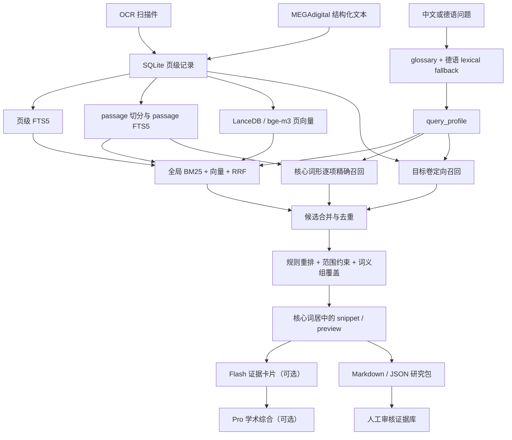

# MEGA² 文献研究工作台：产品说明与使用手册

版本日期：2026-07-20
项目位置：`D:\mega_rag`

## 1. 产品定位

MEGA² 文献研究工作台是一个本地优先、证据导向的马克思恩格斯文献检索系统。它面向 MEGA² 的正文、书信、手稿、摘录和校勘资料，不把全库简单压缩成摘要，而是尽量保留：

- Abteilung、Band、TEXT / APPARAT；
- 德语原文和 passage 上下文；
- MEGAdigital、OCR 等来源类型；
- 作者原文、编者材料和未分类 Textband 的区别；
- 页级或平台级定位、OCR 质量和引用复核警告；
- 检索、重排、证据审核和论文使用之间的审计链。

系统可用中文、德语或中德混合提问。全文检索、向量召回、研究包导出和证据库均可在本地运行；DeepSeek Flash 和 Pro 是可选层，不是检索成立的前提。

## 2. 当前数据与完成状态

截至 2026-07-18：

| 项目 | 状态 |
|---|---:|
| OCR 文件 | 115 / 115，完成 |
| OCR 页面 | 71,641 / 71,641，100% |
| TEXT / APPARAT OCR 页面 | 38,340 / 33,301 |
| OCR 错误页 | 0 |
| 总索引记录 | 82,808 |
| OCR / MEGAdigital 记录 | 71,161 / 11,647 |
| TEXT / APPARAT 索引记录 | 49,683 / 33,125 |
| passage | 109,729，覆盖 81,552 / 81,552 个合格页面 |
| OCR 向量 | 71,161 / 71,161，重复 0，缺失 0 |
| MEGAdigital 向量 | 0；当前有意使用 FTS 与权威文本注入，不强制补向量 |
| 当前索引版本 | `eb2f95c27a168078` |

OCR、页级 FTS、passage FTS 和 OCR 向量已经是完整可检索状态。MEGAdigital 语料保留为独立来源，不覆盖 OCR 文本；排序阶段会优先使用其已验证作者文本。

## 3. 一键启动

双击：

```text
D:\mega_rag\启动MEGA研究工作台.bat
```

浏览器会打开：

```text
http://127.0.0.1:7860
```

工作台包含两部分：

1. MEGA² 文献检索、证据卡片、学术分析和研究包导出；
2. 观点核验：把研究判断拆成原子主张，检索支持、限定和反向证据；
3. 论文证据库的导入、人工审核、标签管理和证据集导出。

没有 `DEEPSEEK_API_KEY` 时，本地检索、原始结果、研究包和证据库仍可使用。需要 Flash 证据卡片或 Pro 学术分析时，再设置用户环境变量并重新启动：

```powershell
[Environment]::SetEnvironmentVariable('DEEPSEEK_API_KEY', 'your-key', 'User')
```

密钥不要写入 `config.yaml`、源码、日志或 Git。

## 4. 检索界面怎么选

### 文献过滤

- `全部`：没有明确限制时使用。
- `正文`：询问“马克思如何论述、定义、批判某概念”时优先使用。
- `校勘`：询问编者说明、版本、异文、手稿关系、出处时使用。

### 检索模式

- `原文优先`：作者论述和概念研究的默认选择。
- `平衡`：同时需要正文和编者材料时使用。
- `校勘优先`：版本和编者问题。
- `版本考证`：保留正文，但提高 APPARAT 的排序位置。

### 重排方法

- `rule`：默认。无需大型本地模型，稳定且可解释。
- `none`：只检查原始召回时使用。
- `bge`：仅在相关依赖已安装时启用；失败会退回 `rule`。

### 其他选项

- `启用缓存`：建议保持开启；重复问题可避免重复 API 和 embedding 计算。
- `Flash`：生成结构化证据卡片，也可在本地术语覆盖不足时补充德语检索词。
- `Pro`：只基于筛选后的证据进行最终综合，不直接阅读整库。
- `跨卷时间线`：适合“不同时期如何变化”一类问题，候选更多、运行更慢。
- `检索数量`：通常 10 至 15；复杂跨卷问题可提高到 20，但会增加后续输入量。

## 5. 推荐研究流程

### 5.1 快速回答

1. 输入具体问题，例如“马克思在《资本论》手稿中如何说明利润率下降趋势？”
2. 选择“正文”和“原文优先”，重排使用 `rule`。
3. 先查看“原始检索结果”，确认卷册、文本层级和德语命中词。
4. 再查看证据卡片和 Pro 分析。
5. 正式引用前核对印刷页码和作者归属。

### 5.2 零 API 成本检索

取消勾选 Flash 和 Pro，执行检索后查看原始结果，或点击“导出研究包”。研究包导出不调用 DeepSeek；Ollama 不可用时仍可退回 SQLite 全文召回。

### 5.3 论文证据积累

1. 点击“导出研究包”，得到 Markdown 和 JSON。
2. 在“论文证据库”中点击“导入最新研究包”。
3. 按 `L######` 编号逐条核对德语文本、层级和页码。
4. 填写“支持的主张、不能支持的主张、直译、研究笔记、论文位置和标签”。
5. 标记为 `accepted`、`needs_verification` 或 `rejected`。
6. 只导出已接受且引用定位可靠的论文证据集，再交给 Codex 写作或补充章节。

### 5.4 交给 Codex 研究

命令行导出：

```powershell
cd D:\mega_rag
python research_export.py "马克思如何讨论利润率下降趋势" --top-k 12
```

建议给 Codex 的约束：

```text
仅依据研究包中的 E### 或证据库中的 L###### 回答；每个实质性判断注明证据编号；
区分作者原文、编者材料和未分类 Textband；locator_verified=false 的材料只能作为
定位线索。证据不足时指出缺口，不得补造引文、页码或作者归属。
```

## 6. 系统架构



### 6.1 数据获取

- `mega_ocr_pipeline.py` 使用 OCRmyPDF、Tesseract `deu` / `deu_frak`，按页生成文本并用 SQLite 记录断点。
- `import_megadigital.py` 导入结构化数字文本，保留来源 URL、卷册和文本层级。
- 两类文本不互相覆盖，便于比较 OCR 与权威数字文本。

### 6.2 索引

- `metadata.db` 保存页级文本、metadata、FTS5、passage、进度和索引版本。
- `passage_index.py` 按段落和字符边界切分，保存 page / passage 关系。
- `vectors.lancedb` 保存 OCR 页级 `bge-m3` 向量；语义召回只作为全文召回的补充。
- 每次索引、chunk 配置、模型或 glossary 变化会形成稳定 `index_version`，使旧缓存自动失效。

### 6.3 查询理解

- `glossary_loader.py` 用最长匹配处理中文概念到德语词形的映射。
- 结构化词条可以声明互不等同的 `senses`，例如 `Pöbel`、`Paria`、`Lumpenproletariat` 不会被自动视为同义词。
- 纯德语查询通过 lexical fallback 直接进入核心词，不依赖术语表。
- 本地词表只覆盖部分中文时，Flash 才补充少量德语检索表达。
- `query_analyzer.py` 将词分为 core、work、author、generic，并识别意图和目标卷册。

### 6.4 多路召回

1. 全局召回：passage/page BM25 + `bge-m3` 向量，用 RRF 融合。
2. 核心词形召回：每个高价值德语短语单独检索，小桶轮询注入，防止宽泛 OR 查询挤掉稀有词形。
3. 目标卷召回：有明确著作/卷册且属于作者论述型问题时，在目标卷 TEXT 内补充候选。
4. 权威文本注入：目标卷存在 MEGAdigital 作者文本时，保留一个独立候选通道。

### 6.5 排序和证据抽取

- `rerank.py` 统一“分数越高越相关”，综合 RRF、精确词命中、文本层级、TEXT / APPARAT、目标卷和 OCR 质量。
- `scope_constrained_rerank` 在目标卷正文候选充足时优先目标卷 TEXT，但不删除范围外材料。
- `concept_retrieval.py` 为多义概念保留不同词义组的代表证据，并优先已验证作者原文。
- `snippet_extractor.py` 围绕当前记录实际命中的核心词截取，不再围绕“Marx、Kritik”等泛词截取。

### 6.6 模型分工

- 本地 FTS / 向量：召回和定位，不产生 API token 费用。
- DeepSeek Flash：必要时补检索词、生成证据卡片和直译；不承担最终学术判断。
- DeepSeek Pro：只接收筛选后的证据，负责跨证据综合和中文回答。
- 人工审核：决定证据是否可正式进入论文，不由模型自动替代。

## 7. 关键实现文件

| 文件 | 职责 |
|---|---|
| `config.yaml` | 本机路径、Ollama、模型和缓存配置 |
| `build_index.py` | 增量页索引、向量修复、状态和版本刷新 |
| `passage_index.py` | passage 建库、状态与 FTS 一致性 |
| `import_megadigital.py` | MEGAdigital 结构化语料导入 |
| `glossary.yaml` | 中文概念、德语词形、词义组和卷册提示 |
| `glossary_loader.py` | 新旧词表兼容、最长匹配和模型扩展解析 |
| `query_analyzer.py` | 查询分类、意图和著作到卷册映射 |
| `concept_retrieval.py` | 核心词形召回、来源合并和词义组覆盖 |
| `rerank.py` | 可解释规则重排和范围约束 |
| `snippet_extractor.py` | snippet、preview 和命中词定位 |
| `webui.py` | Gradio 检索、Flash / Pro、缓存和研究包按钮 |
| `research_export.py` | 无 DeepSeek 的 Markdown / JSON 研究包导出 |
| `claim_audit.py` | 原子主张拆分、证据关系校准和观点核验报告 |
| `claim_schema.py` | 稳定结论标签、证据关系和三档资源预算 |
| `model_gateway.py` | 严格 JSON 解析、一次修复和 API token 统计 |
| `agent_service.py` | 检索、核验、证据展开和状态的统一服务层 |
| `mega_agent.py` | 供 Codex、OpenCode 和脚本使用的 JSON-only CLI |
| `claim_audit_ui.py` | 观点核验工作台页面 |
| `evidence_library.py` | 持久证据库、审核历史和论文证据集导出 |
| `research_workbench.py` | 将检索、观点核验与论文证据库组合为一个窗口 |

OCR 主程序位于：

```text
D:\学习资料\马克思主义研究\马恩原著\马恩全集\MEGA 2\mega_ocr_pipeline.py
```

## 8. 数据文件与备份

| 路径 | 内容 |
|---|---|
| `D:\mega_rag\metadata.db` | 页、passage、FTS、进度、版本 |
| `D:\mega_rag\vectors.lancedb\` | 本地向量 |
| `D:\mega_rag\cache.db` | 查询和回答缓存 |
| `D:\mega_rag\research_exports\` | 一次性 Markdown / JSON 研究包 |
| `D:\mega_rag\research_library.db` | 人工审核后的长期证据库 |
| `D:\mega_rag\research_library_exports\` | 论文证据集 |
| `...\MEGA 2\ocr_progress.db` | OCR 断点进度 |

关机前应停止仍在写入的索引或 OCR 进程。备份证据库时最好先关闭工作台；若未关闭，需要同时复制 `.db`、`.db-wal` 和 `.db-shm`。

## 9. 成本控制

最低成本路径是：本地检索 -> 原始结果 -> 研究包 -> 人工审核。该路径没有 DeepSeek API 费用。

启用模型时：

- Flash 只读取少量查询词或筛选后的 snippet；
- Pro 只读取证据卡片，不读取整页、整卷或全部候选；
- 缓存键包含查询、过滤、模型、prompt 和 index version，重复问题可直接复用；
- 研究包会显示证据上下文的粗略 token 数，但这是后续输入估算，不是已经产生的费用。

跨卷时间线、较大的 `top_k` 和很长的证据卡片会增加输入 token。通常先用 10 至 15 条证据，确认缺口后再扩大。

## 10. 状态检查与防回退测试

```powershell
cd D:\mega_rag
python index_health.py
python build_index.py --status
python passage_index.py --status
python test_passage_index.py
python test_retrieval_regression.py
python test_research_export.py
python test_evidence_library.py
```

OCR 状态：

```powershell
cd "D:\学习资料\马克思主义研究\马恩原著\马恩全集\MEGA 2"
python mega_ocr_pipeline.py --status
```

修改 `glossary.yaml` 后运行一次轻量版本刷新：

```powershell
cd D:\mega_rag
python build_index.py --build --no-embed
python index_health.py
```

修改 glossary、查询分析、核心召回、重排、snippet 或 Web UI 后，必须运行 `test_retrieval_regression.py`。出现 `FAIL_ALG` 时不能视为可发布；`XFAIL_DATA` 表示测试语料尚未覆盖。

## 11. 新增术语或著作

新增概念优先修改 `glossary.yaml`，使用结构化格式：

```yaml
某概念:
  type: concept
  priority: high
  de:
    - 德语短语
    - 词形变体
  senses:
    - id: sense_a
      label: 词义 A
      terms: [德语词 A]
    - id: sense_b
      label: 词义 B
      terms: [德语词 B]
```

不同词义不是同义词时必须拆成 `senses`。新增著作到卷册映射时修改 `query_analyzer.py` 的 `WORK_VOLUME_MAP`，卷册只用于软范围约束，不替代核心概念命中。

## 12. 已知边界

- OCR 完成不等于每个字都正确；低质量页会降权并显示警告。
- `TEXT` 表示位于正文卷，不自动证明该段就是马克思或恩格斯原文。
- `textband_unclassified` 必须人工核对；`author_text` 只用于结构依据充分的文本。
- APPARAT、编者导言、索引和异文不得写成作者观点。
- MEGAdigital `source page` 和 OCR PDF physical page 只是定位线索，不能冒充印刷页码。
- “贱民”一类中文词可能对应多个非等价历史范畴；系统负责分别召回和标注，不替研究者决定概念同一性。
- “经济状况在不同时期如何变化”一类问题需要跨卷时间线和多封书信，单次 top-k 不能保证构成完整传记叙事。
- 当前未为 11,647 条 MEGAdigital 记录强制补向量，因为现有 FTS、核心词形和权威文本注入已能稳定召回；出现可复现的语义缺口后再做选择性向量实验。

## 13. 常见故障

### 浏览器打不开

确认地址是 `http://127.0.0.1:7860`，不是外网地址。手机热点不影响本地地址。若端口已被旧进程占用，关闭旧工作台后重新双击启动文件。

### 中文无结果、德语有结果

查看执行状态中的 matched glossary、core terms 和 Flash expansion。为稳定复现，应把确认后的中德映射加入 `glossary.yaml`，然后刷新 index version 并跑回归测试。

### Flash 扩展失败但证据卡片能生成

两次调用的 prompt 和解析要求不同。扩展层失败会回退本地词表，不应导致整个查询失败；查看日志中的解析提示。

### 只有编者材料

先确认问题属于作者论述还是版本考证；作者论述选择“正文 / 原文优先”。再检查结果的 `text_layer`，不能仅根据 TEXT / APPARAT 标签判断作者身份。

### 健康检查提示 stored version stale

运行：

```powershell
python build_index.py --build --no-embed
```

该命令不会重新计算全部向量，只登记当前可检索状态的新版本。

## 14. 当前可达到的效果

系统已经可以作为完整的本地研究基础设施使用：

1. 在 71,641 页 OCR 和 11,647 条 MEGAdigital 记录中进行中德混合检索；
2. 对稀有词形、多义概念和明确目标卷进行补充召回；
3. 区分正文、APPARAT、作者原文、编者材料和未分类文本；
4. 输出围绕实际核心词的德语证据，而不是只显示作品名或作者名附近片段；
5. 用低成本 Flash 生成证据卡片，再由 Pro 进行受证据约束的综合；
6. 无 API 地导出研究包，并在人工审核后形成可供 Codex 补写论文的证据集；
7. 通过版本、缓存、debug 信号和回归测试降低后续修改造成的检索退化；
8. 把用户观点拆成可检验主张，分别寻找支持、限定和反向证据；
9. 让外部 Agent 先读取短证据索引，再按 E### 展开少量原文，从而控制 token。
10. 把复合问题拆成原文重建、概念桥接、反作用因素和外部经验分支，并要求全部必要分支分别达到充分性标准。

它仍不是自动完成文献考证的替代品。正式论文中的引文、页码、作者归属和概念同一性必须经过人工核验。

## 15. 观点核验与 Agent 调用

工作台中的“观点核验”默认使用 `brief` 预算和 Flash，Pro 默认关闭。零 API 模式和机器接口：

```powershell
cd D:\mega_rag
python mega_agent.py search "你的研究问题" --detail index --save
python mega_agent.py research-plan "你的复合研究问题"
python mega_agent.py research-run "你的复合研究问题" --detail index
python mega_agent.py verify "你的观点" --budget brief
python mega_agent.py verify "你的观点" --local-only
```

结论会区分强支持、部分支持、需要限定、缺乏支持、存在反证和证据不足。编者材料不能自动证明作者观点，未验证 Textband 不能产生强支持。完整原理与使用见 `docs/claim_audit.md`，外部 Agent 协议和可选 MCP 见 `docs/agent_integration.md`。

## 研究型检索的证据边界

新版工作台在回答前返回 `retrieval_adequacy`、`candidate_class` 和 `evidence_eligible`，用于区分直接正文证据、结构性语境、相关但不等同的概念、编者/索引材料和只有泛词命中的页面。

对于“主要、总是、仅仅、从未”等强命题，普通 top-k 结果只能提供局部证据，不能证明全语料分布。系统会标记 `partially_answerable`，并建议做词频、对照概念和负样本抽查。

外部 Agent 的推荐方式是：先 `plan`，必要时补充 refinement，再 `search(detail=index)`，最后只展开少量选中的 `E###`。参见 `agent_query_plan.md`。

复合问题应改用 `research-plan` 和 `research-run`。后者会返回每个分支的充分性、claim-evidence matrix、尚缺的外部经验材料，并采用轮转证据预算防止第一个分支占满候选。完整设计见 `docs/research_orchestration.md`。

## 研究报告的可靠性状态

工作台把结果分为诊断候选包与可综合证据包。界面或 Agent 返回多条结果时，仍需查看 `synthesis_gate`；只有 `synthesis_allowed=true` 才能进入回答阶段。正式引用还要求证据本身 `quote_eligible=true`。

跨查询保存或合并证据时使用 `evidence_uid`。`E001` 只是单个包内的显示序号。外部 Agent 的报告可以用 `python mega_agent.py report-check 报告.json 来源.json` 做零 API token 校验。
